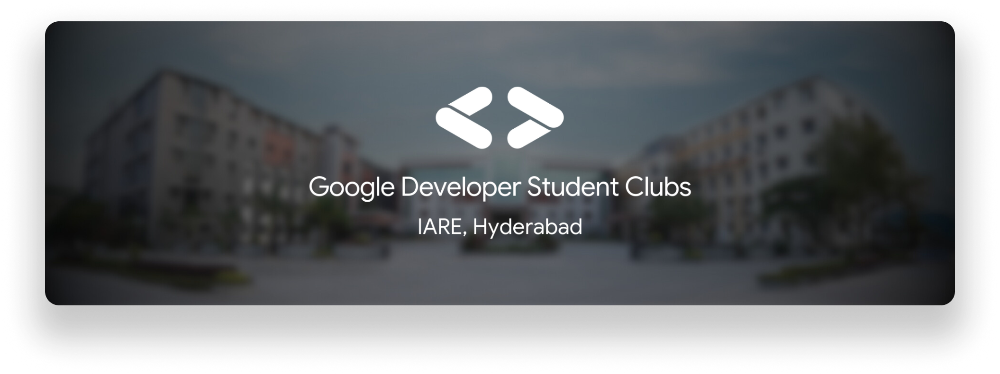
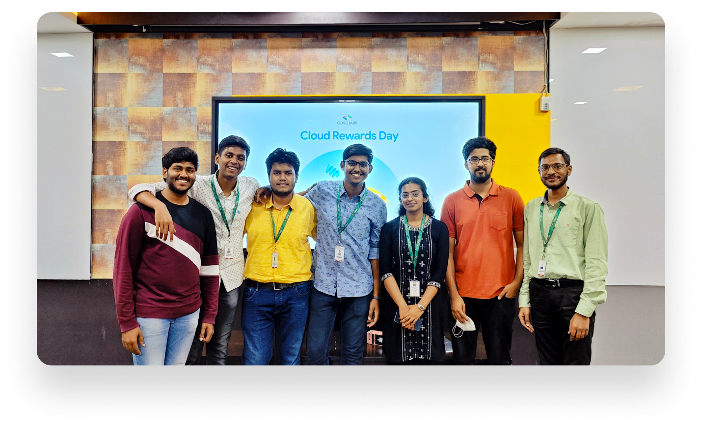
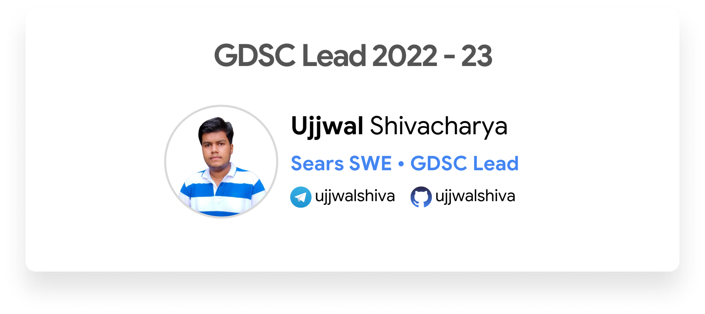
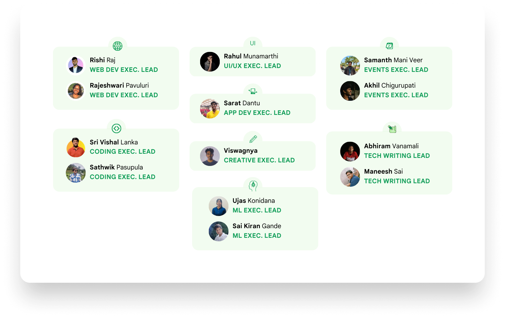
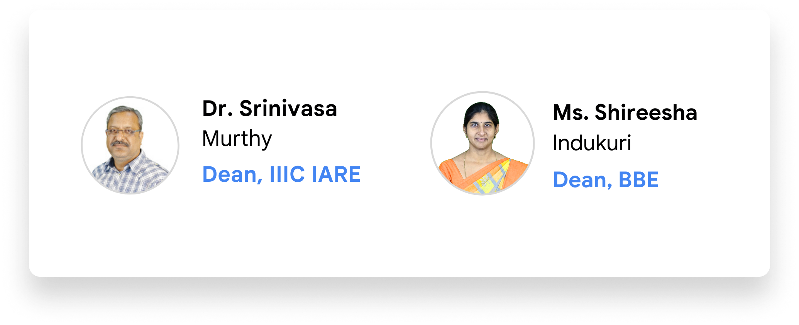
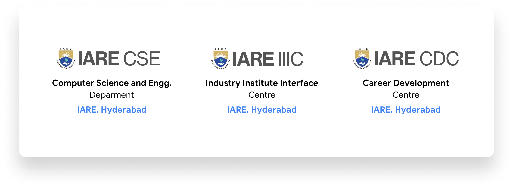
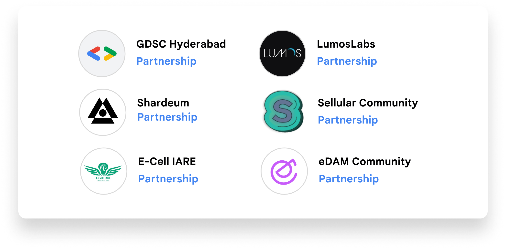
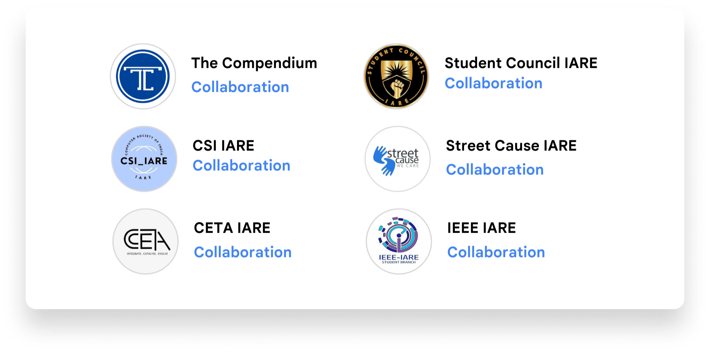

import Image from 'next/image'

# About Us

**GDSC IARE** is an institution-exclusive chapter of Google Developer Student Clubs driven by passionate students from **IARE, Hyderabad**. 

We are a group of students passionate about Technology. Our objective is to bring together students from various fields of interest who love learning and applying their skills to solve real-world problems.

## Meet the Team

**GDSC IARE** was first started in 2022 by [Ujjwal Shivacharya](https://ujjwalshiva.github.io), a passionate student pursuing BTech in CSE at IARE Hyderabad who got selected as the GDSC Lead for IARE Hyderabad for the year 2022-23. Since then, the community has seen exponential growth both in terms of strength and quality campaigns. During the 2022-23 term, the team structure looked as follows:

## Connect with the Lead

- Connect with Ujjwal on [LinkedIn](https://www.linkedin.com/in/ujjwalshiva/)
- Currently 4th Year BTech Student at IARE, Hyderabad (as of 2023)

Feel free to mail any queries to gdsc[at]iare.ac.in to connect with Lead and Core Team

## Core Team 2022-23

## Executive Team 2022-23

## Faculty Mentors 2022-23

GDSC IARE is proud to have [**Dr. Srinivasa Murthy**](https://in.linkedin.com/in/p-l-srinivasa-murthy-36828428) as the  official **Faculty Mentor** for GDSC IARE for the tenure 2022-23. His constant support and motivation has helped us grow as the largest tech developer community at IARE, Hyderabad. In the past year, GDSC IARE has grown significantly. We have greatly increased our memberships, and have organized several successful events, including hackathons, workshops, and speaker sessions. We are confident that with the continued support of Dr. Srinivasa Murthy sir, we will surely grow and achieve even greater milestones in the future.

We would also like to thank [**Ms. Shireesha Devi**](https://in.linkedin.com/in/shireesha-indukuri-674a791a7) Ma'am, for her constant support in organizing events and enhancing public visibility of our community among students. Her role in establishing the **Student Council** in the campus has truly helped a lot of communities in streamlining their activities under a single division.

## Supporting Departments 2022-23

## Partnerships 2022-23

## Social Media Collaborations 2022-23

