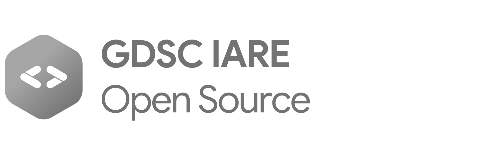
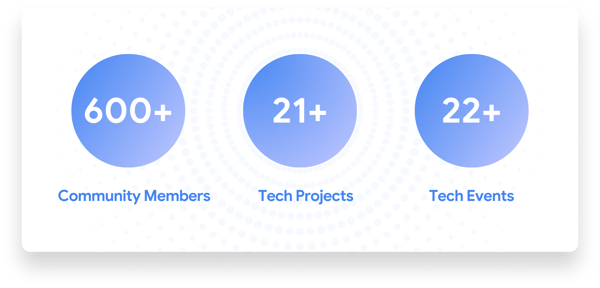
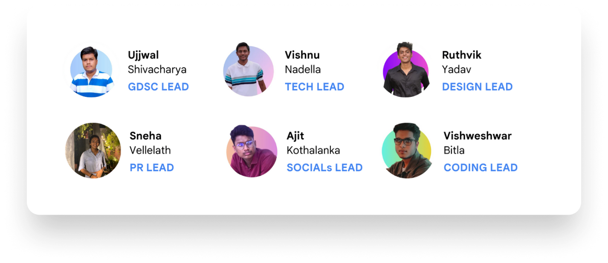

import { Card, Cards } from "nextra-theme-docs";

# Introduction

Welcome to GDSC IARE Community. We're building this Open Source Platform as a one-stop centre to know everything about GDSC IARE. You can find pretty much everything that we have been doing since the past year (2022-23).

Loved our content? Drop us your comments at [gdsc@iare.ac.in](mailto:gdsc@iare.ac.in)

 

<Card
    icon={
        
    }
    title="Be a Member of GDSC IARE!"
    href="https://gdsc.community.dev/accounts/login/?next=/institute-of-aeronautical-engineering-hyderabad/"
    target="_blank"
/>

## Overview

**GDSC IARE** is an institution-exclusive chapter of **Google Developer Student Clubs**, driven by passionate students from our college.

Google Developer Student Clubs (GDSCs) are university-based community groups powered by Google Developers for students interested in the latest technologies. The aim is to help students bridge the gap between theory and practice. Students from all undergraduate or graduate programs with an interest in growing as a developer are welcome. We aim at solving real life problems by building tech projects using the best of technologies, and create an impact around.

This community was first started in **August 2022** by **Ujjwal Shivacharya**, when he was selected as the first GDSC Lead at IARE, Hyderabad. Since then, the community has grown exponentially in providing value-driven content and promoting latest technologies amongst all its tech-savvy members. With 1000s of views in engagement, GDSC IARE is helping several budding developers connect with industry leaders, and network with like minded people from other GDSCs.

## Our Status right now

## Leadership at GDSC IARE 2022-23

## Quick Links

<Cards>
  <Card
    icon={
        
    }
    title="What We Do"
    href="/whatwedo"
  />

  <Card
    icon={
        
    }
    title="Our Initiatives"
    href="/ourinitiatives"
  />

  <Card
    icon={
        
    }
    title="Gallery"
    href="/gallery"
  />
</Cards>

<Cards>
  <Card
    icon={
        
    }
    title="Tech Projects"
    href="/tech_projects"
  />

  <Card
    icon={
        
    }
    title="Resources"
    href="/resources"
  />

  <Card
    icon={
        
    }
    title="Social Media"
    href="/socials"
  />
  
</Cards>
