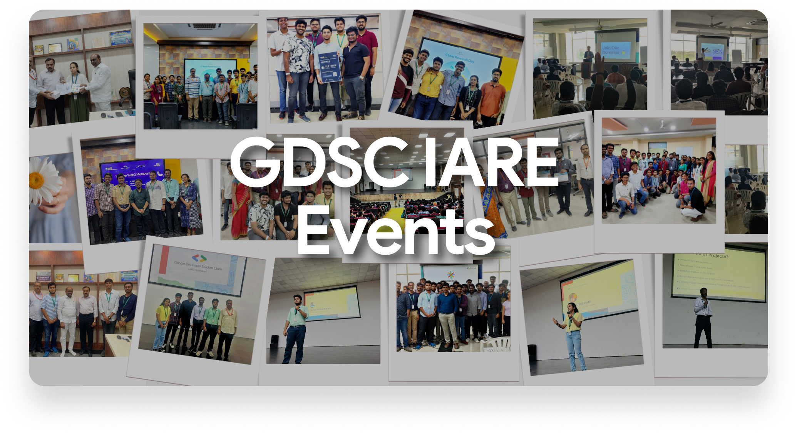

# Our Events

### The Kotlin and Jetpack Compose Camp Series

The Kotlin and Jetpack Compose Camp is a 4 day session event organised by Google Developer Student Clubs, IARE Hyderabad. The event focuses on covering the basics of Android App Development using Kotlin and Jetpack Compose, with 4 days of training planned during the month of September, 2022. These 4 days of sessions are facilitated by Praneetha Peniji, who is currently pursuing BTech 3rd Year CSE AI & ML, and is also an App Development Intern at NFC Solutions. The event is conducted online using GDSC Events Platform, and the same is also livestreamed on GDSC IARE Official Youtube Channel. All the coordination and the support required for communication with the attendees are being managed by the Core Team of GDSC IARE. 

View Event Details [here](https://gdsc.community.dev/events/details/developer-student-clubs-institute-of-aeronautical-engineering-hyderabad-presents-kotlin-and-jetpack-compose-camp-day-1/)

### GDSC IARE Meet Up 1.0

GDSC IARE Meet Up 1.0 is a networking session organized by the core team of Google Developer Student Clubs, IARE Hyderabad. The event was held between 2PM to 4PM on 29th of October, 2022 at CDC Center, IARE Hyderabad. A total of 104 members registered and students from all years actively participated in the event.

The agenda of the event is as follows:

* Interaction with Community Members
* Share Technical Project Ideas that we'll be building this year
* Talk about benefits of becoming a GDSC Member
* Introduce Open Source Contributions with Git and GitHub
* Showcase Projects we're developing and have developed so far
* Invite members to different domains at GDSC IARE

View Event Details [here](https://gdsc.community.dev/events/details/developer-student-clubs-institute-of-aeronautical-engineering-hyderabad-presents-gdsc-iare-meet-up-10/)

### GDSC IARE Freshers Induction Program

GDSC IARE Freshers Induction Program is an orientation session organized by the core team of Google Developer Student Clubs, IARE Hyderabad. The event was held all day on 12th of November, 2022 at Sangeeth Auditorium, IARE Hyderabad. A total of 800+ students from first year actively participated in the event.

The agenda of the event is as follows:

* Interaction with Freshers 
* Share Technical Project Ideas that we'll be building this year
* Talk about benefits of becoming a GDSC Member
* Introduce Open Source Contributions with Git and GitHub
* Showcase Projects we're developing and have developed so far
* Invite students to different domains at GDSC IARE

View Event Details [here](https://gdsc.community.dev/events/details/developer-student-clubs-institute-of-aeronautical-engineering-hyderabad-presents-gdsc-iare-freshers-induction-program/)

### Intro to Web Development

GDSC IARE Intro to Web Development Event is an online technical session organized by the core team of Google Developer Student Clubs, IARE Hyderabad. The event was held on 19th of November, 2022 with Google Meet as the streaming platform.  The speakers of the event are [Rishi Raj](https://www.linkedin.com/in/rishi-raj-a36930206/) (CSE 3rd Year) and [Rajeshwari](https://www.linkedin.com/in/pavuluri-rajeshwari-497a34210/) (IT 3rd Year) who are also the Web Development Executive Leads at GDSC IARE Community. A cumulative count of over 75 student members of the community actively participated in the event.

The agenda of the event is as follows:

* Talk about basics of Web Development
* Introduce Web Development Technologies i.e HTML and CSS
* Explain various tags and functionalities in HTML
* Live code along session to build a website from scratch
* Interactive conversations and doubt clearing moments during the session

View Event Details [here](https://gdsc.community.dev/events/details/developer-student-clubs-institute-of-aeronautical-engineering-hyderabad-presents-intro-to-web-development/)

### TLE Hack - Coding Contest

TLE Hack is a coding contest organized as a part of Consortium 22 - A National Tech Fest organised by IARE, Hyderabad. This event is being organised in collaboration with IEEE IARE Student Chapter with Google Developer Students Club IARE, Hyderabad as the Technology Partner. The event was held between 24th and 25th November 2022, in Labs 3304 and 3305 at Aryabhata Block.  A cumulative count of over 124 students from IARE, Hyderabad as well as other colleges attended the event and competed against each other in the contest.

The agenda of the event is as follows:
* **Day 1 Round 1**: 
    * Solve 5 Questions in BuildIT, a maximum of 2 hours will be provided
Shortlisted Candidates to Finale Announced
* **Day 2 Finale**: 
    * Rapid Coding in HackerRank, the fastest who solves 3 questions under an hour wins TLE Hack
    * Winners announced

View Event Details [here](https://gdsc.community.dev/events/details/developer-student-clubs-institute-of-aeronautical-engineering-hyderabad-presents-tle-hack-coding-contest/)

### GDSC Solution Challenge 101

The Solution Challenge 101 is a 1 day info session event organized on the 30th of January, 2023, by Google Developer Student Clubs, IARE Hyderabad. The event focuses on covering the guidelines for Google's Solution Challenge for all GDSCs and how students can get started with building projects for this International Hackathon. The speakers for this event include Ms. Nikitha Gandhi -  Google Developers India Community Manager, Het Patel - Solution Challenge 2022 Top 3 Winner, Akash Srivastava - Solution Challenge 2022 Top 10 Winner and Arjun K Haridas - Solution Challenge 2022 Top 50 Winner. The event was conducted online using Youtube Platform, and the same is also livestreamed on [Diversity in GDSC](https://www.youtube.com/c/DiversityinDSC) Official Youtube Channel. All the coordination and the support required for communication with the attendees are being managed by the Core Team of GDSC IARE. 

View Event Details [here](https://gdsc.community.dev/events/details/developer-student-clubs-institute-of-aeronautical-engineering-hyderabad-presents-gdsc-solution-challenge-101/)

### GDSC IARE x LumosLabs

GDSC IARE x LumosLabs is a 1 day session event organised on 10th of February, 2023, by Google Developer Student Clubs, IARE Hyderabad. The event focuses on community building, and explores deep into concepts of Web3, Metaverse and dApps. This session is facilitated by Nikhil Aparijit, who is currently Community Lead at Team LumosLabs, and was also joined by folks from Router Protocol. The event is conducted offline  at Sarang Hall. All the coordination and the support required for communication with the attendees are being managed by the Core Team of GDSC IARE, with the support of IIIC, IARE. 

View Event Details [here](https://gdsc.community.dev/events/details/developer-student-clubs-institute-of-aeronautical-engineering-hyderabad-presents-gdsc-iare-x-lumoslabs/)

### GDSC IARE x Shardeum

GDSC IARE x Shardeum is a 1 day session event organised on the 25th of February, 2023, by Google Developer Student Clubs, IARE Hyderabad. The event focuses on community building, and explores deep into concepts of Web3, Blockchain and Smart Contracts. This session is facilitated by Susmitha and Suhas from Team Shardeum. The event is conducted offline at Sarang Hall/AV Centre. All the coordination and the support required for communication with the attendees are being managed by the Core Team of GDSC IARE, with the support of IIIC, IARE. 

View Event Details [here](https://gdsc.community.dev/events/details/developer-student-clubs-institute-of-aeronautical-engineering-hyderabad-presents-gdsc-iare-x-shardeum/)

### Fundamentals of ML - SC101

Fundamentals of ML is a 1 day info session event organized on the 14th of April, 2023, by Google Developer Student Clubs, IARE Hyderabad. The event focuses on introducing the foundations of Machine Learning and how students can get started with building models and deploy as projects. The speaker for this event is [Shivang Chopra](https://www.linkedin.com/in/shivangchopra11), currently pursuing MSCS at Georgia Tech. The event was conducted online using Google Meet Platform, and the same is also recorded by the organizing GDSC. All the coordination and the support required for communication with the attendees are being managed by the Core Team of GDSC IARE. 

View Event Details [here](https://gdsc.community.dev/events/details/developer-student-clubs-institute-of-aeronautical-engineering-hyderabad-presents-fundamentals-of-ml//)

### GDSC IARE Cloud Rewards Day

GDSC IARE Google Cloud Rewards Day is a 1 day event organised on the 18th of April, 2023, by Google Developer Student Clubs, IARE Hyderabad. The event focuses on community building, and was organised for distribution of rewards to the 33 members, who successfully completed Google Cloud Career Practitioner's Campaign during December 2022 - January 2023. This session is facilitated by the GDSC IARE Core Team with Dr. Hari Nath, HOD of Mechanical Dept as the Chief Guest to motivate the community members. The event is conducted offline at Sarang Hall/AV Centre. All the coordination and the support required for communication with the attendees are being managed by the Core Team of GDSC IARE, with the support of IIIC, IARE. 

View Event Details [here](https://gdsc.community.dev/events/details/developer-student-clubs-institute-of-aeronautical-engineering-hyderabad-presents-google-cloud-rewards-day/)

### GDSC WOW Hyderabad 2023

GDSC WOW Hyderabad is a mega 1 day event organised on the 29th of April, 2023, by GDSCs all over Hyderabad. GDSC WOW is a series of technical events happening in collaboration with GDSCs across India. The event focuses on community building, speaker sessions on amazing technologies and some delicious food. The event took place on the 29th of April 2023 at JNTU UGC Auditorium. The event witnessed over 300 attendees joining the event from several colleges in Hyderabad.  There was an incredible lineup of speakers who shared their experiences and knowledge,  and inspired and motivated the attendees to upskill with the latest technologies.

View Event Details [here](https://gdsc.community.dev/events/details/developer-student-clubs-institute-of-aeronautical-engineering-hyderabad-presents-gdsc-wow-hyderabad-2023/)

