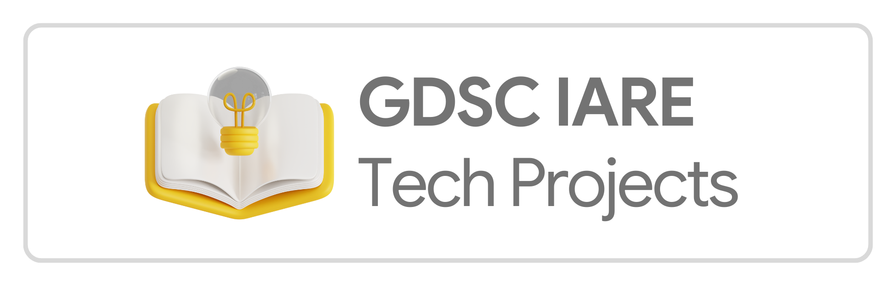
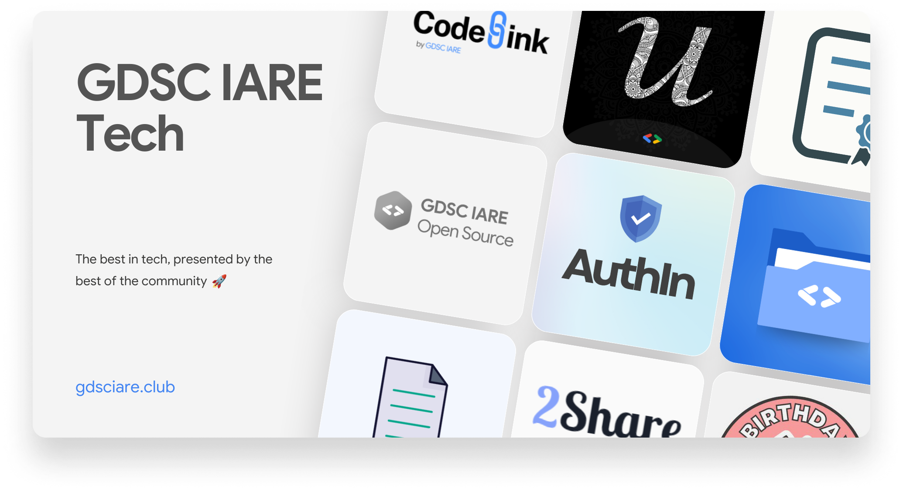
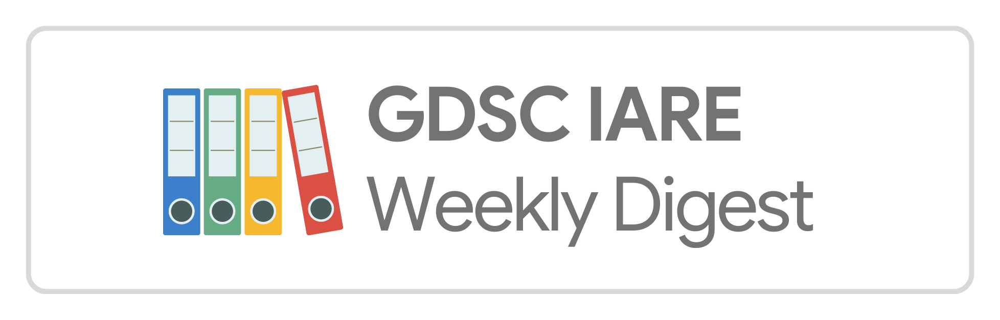
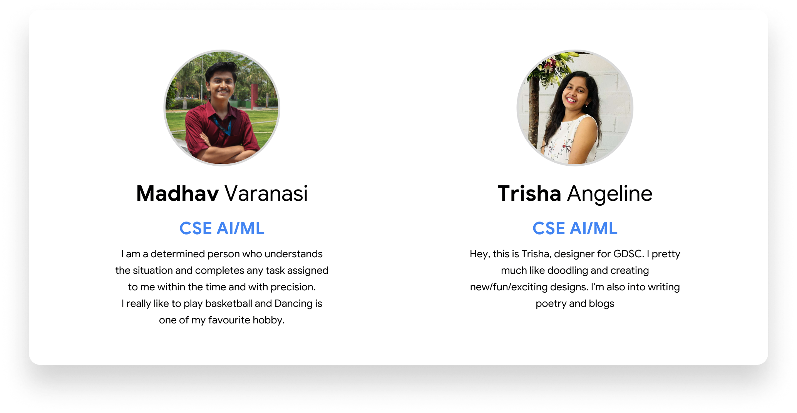
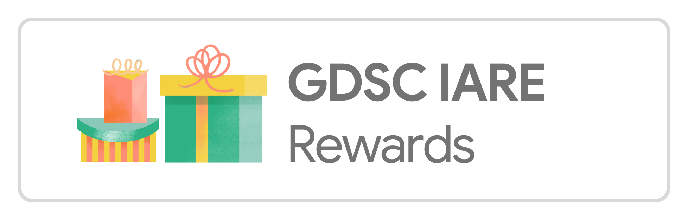
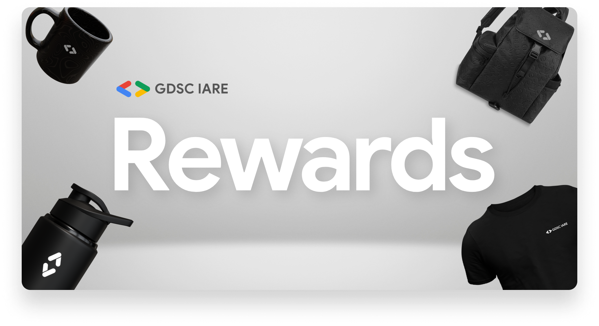
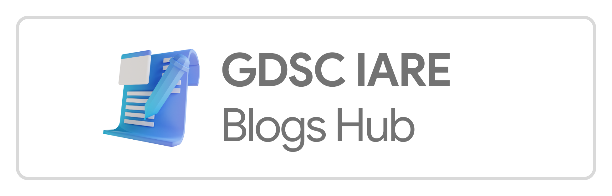
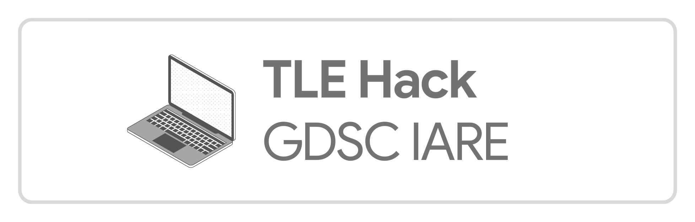

import { Callout } from 'nextra/components'
import Image from 'next/image'

# Our Initiatives

In the year 2022-23, GDSC IARE started several programs and initiatives that benefit the student members in the community. Here's a list of initiatives for you to check out.

* [GDSC IARE Tech Projects](/ourinitiatives#gdsc-iare-tech-projects)
* [GDSC IARE Weekly Digest](/ourinitiatives#gdsc-iare-weekly-digest)
* [GDSC IARE Rewards](/ourinitiatives#gdsc-iare-rewards)
* [GDSC IARE Blogs Hub](/ourinitiatives#gdsc-iare-blogs-hub)
* [TLE Hack by GDSC IARE](/ourinitiatives#tle-hack-by-gdsc-iare)

Have a look at them in detail below and the feedback we received from the community members.

## GDSC IARE Tech Projects

GDSC IARE Tech Projects is our flagship program that promotes project building among members and encourage them to build technical projects for the community. This helps in simplifying tasks using the best of technology, while also helping our members share their apps/websites with our vast community. With over 20+ technical projects built in less than 9 months, we're amazed with the response that we have received from our community members. Web Apps like [Blogs Hub](https://blogs.gdsciare.club), [Weboris](https://gdsciare.club/weboris), [QB Solutions Archive](https://qbsolutions.gdsciare.club) have recieved over **10000+ visits** in total, being the most popular services used in college till date.

Explore our tech projects [here](/tech_projects)

## GDSC IARE Weekly Digest

GDSC IARE Weekly Digests was an initiative started to break down tech news into bite-sized creative content and share it with our community members via Instagram and LinkedIn during the weekends. For the year 2022-23, [Madhav Varanasi](https://www.linkedin.com/in/madhav-varanasi-9365621a5/) and [Trisha Angeline](https://www.linkedin.com/in/e-f-trisha-angeline-a1873a229/) took up this intitiative and shared content on a weekly basis on Instagram and bi-weekly basis on LinkedIn. Each of our Weekly Digests received an average of 500+ views on our [Instagram](https://instagram.com/gdsciare) handle and 1200+ views on our [LinkedIn](https://www.linkedin.com/company/gdsciare/) page. Many community members found it helpful as it summarized all the tech news in a week with neat infographics. Feel free to follow/ping Madhav and Trisha on their Instagram handles [@madhav_v3](https://instagram.com/madhav_v3) and [@trxx__16](https://instagram.com/trxx__16). 

### Our Active Contributors @Weekly Digest

## GDSC IARE Rewards

GDSC IARE Rewards Program started out as an initiative to reward those members who made contributions to the community and utilised the best of our campaigns/events to upskill and learn more. As a way to thank these amazing people, this program helped us reward them with goodies/schwags for the efforts that they've put in making these campaigns worthy. Over 150+ rewards were distributed to the community members and they just loved it 💖. Exclusive Google Merch, Smart Bottles, Headphones, TShirts, Backpacks, you name it... We had them all!

<Callout type="info" emoji="😮">
    Over 150+ rewards were distributed to the community members during the year **2022-23** by the GDSC Lead and Core Team.
</Callout>

## GDSC IARE Blogs Hub

GDSC IARE Blogs Hub was launched to promote technical writing and effective communication of technical development to our community members. The year 2022-23 saw many contributions from the community, where several members turned up to share their views on various technologies through blogs. The Blogs Team was lead by Abhiram Vanamali and Sai Maneesh, who actively collated blogs from the contributors and shared with the community. All blogs shared by the members are available for public access on the [GDSC IARE Blogs Hub](https://blogs.gdsciare.club).

## TLE Hack by GDSC IARE

TLE Hack, was the very first coding competition organized by GDSC IARE, in partnership with IEEE-IARE. This competition was held as a part of Consortium 2022 - an annual technical fest conducted by IARE, Hyderabad. This competition witnessed several participants from various colleges, with unique and creative problems crafted by our Coding Team at GDSC IARE. Thanks to our team members [Ujjwal Shivacharya](https://www.linkedin.com/in/ujjwalshiva), [Vishnu Sai Nadella](https://www.linkedin.com/in/vishnu-nadella-007/), [Sri Vishal Lanka](https://www.linkedin.com/in/sri-vishal-lanka-73a7b420a/), [Satwik Pasupula](https://www.linkedin.com/in/pasupula-satwik-225392238/), [Samanth Mani Veer](https://www.linkedin.com/in/samanth-mani-veer-yedhupati-41a89b20a/) and more, the competition was a huge success and we plan to organize further editions in the years to come.

