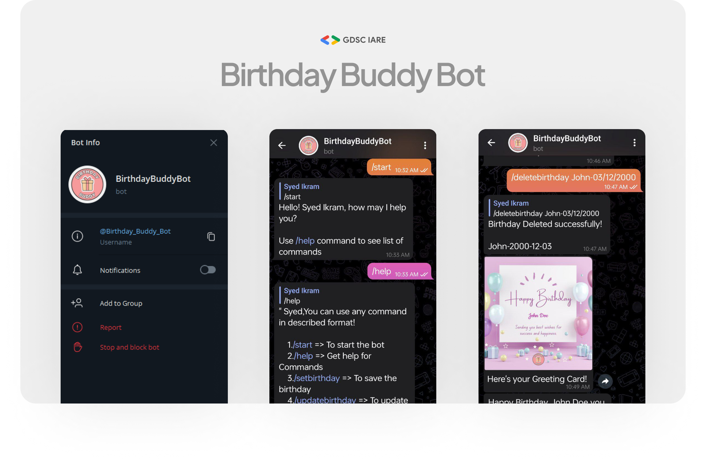
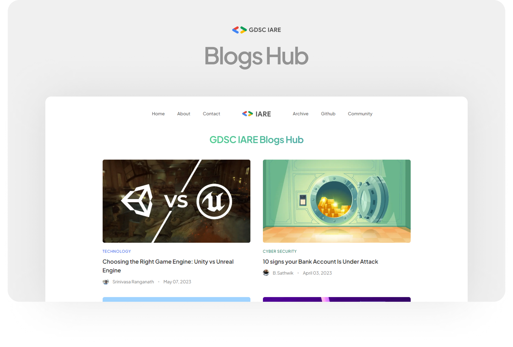
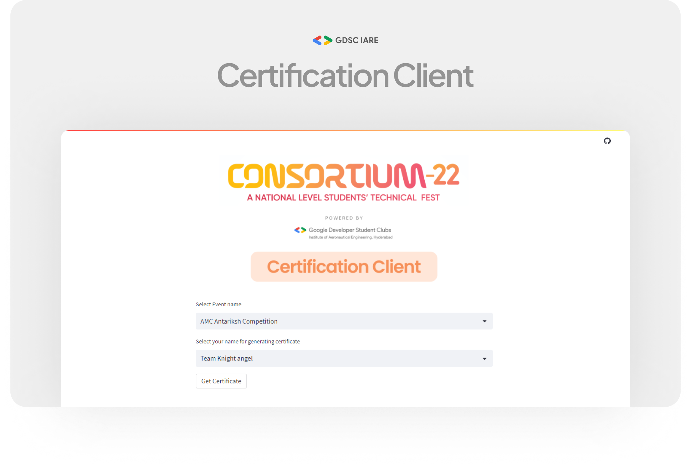
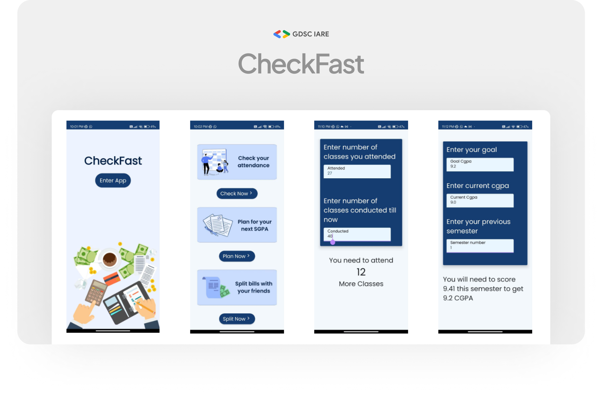
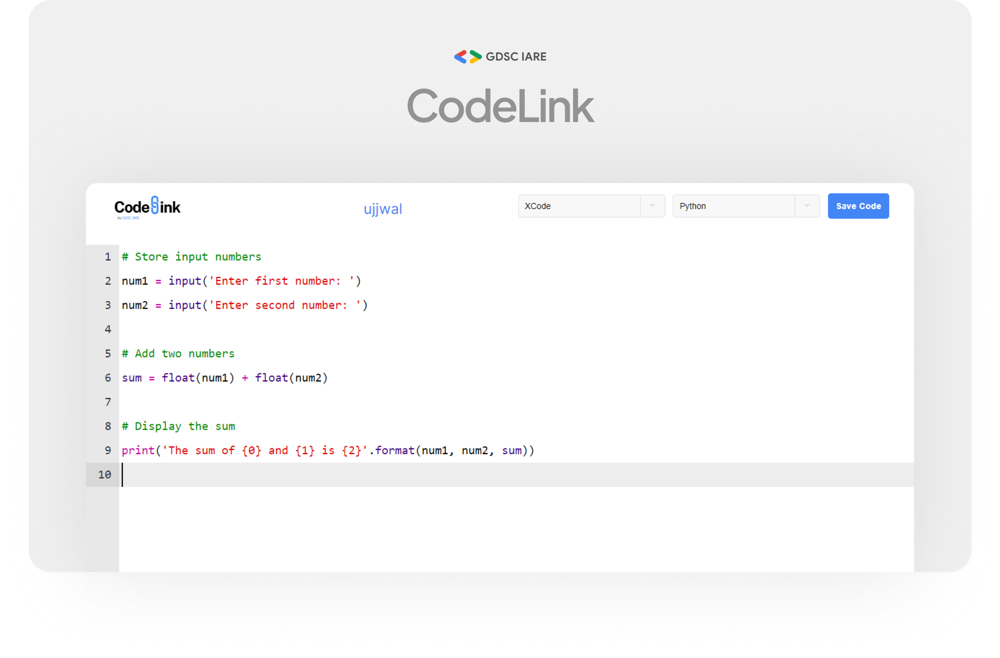
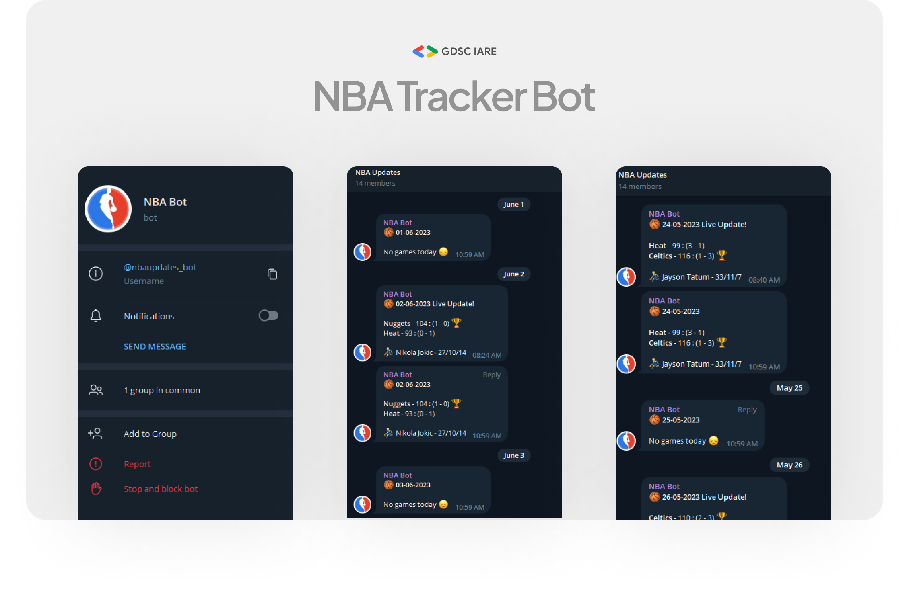
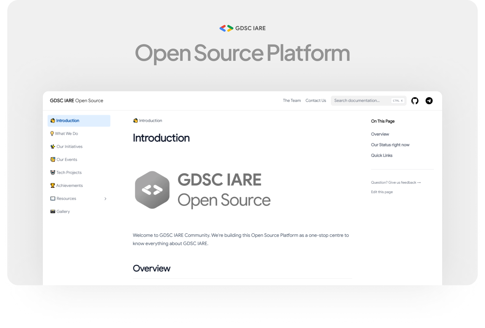
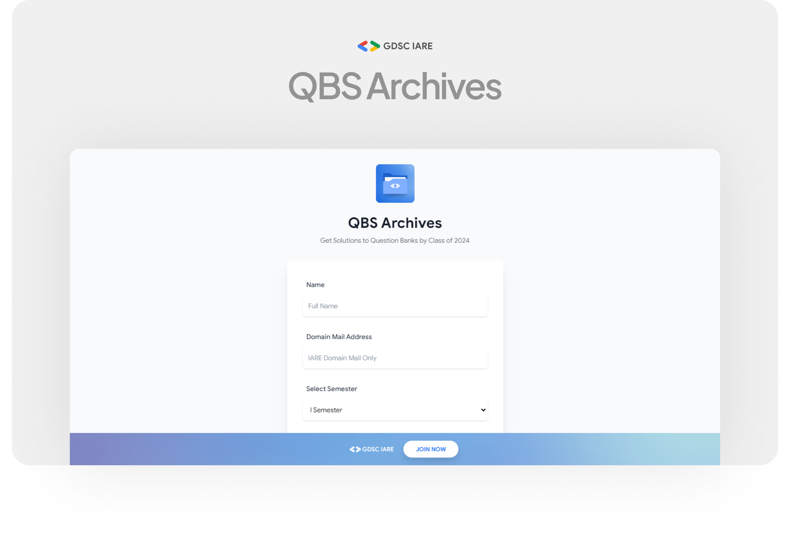
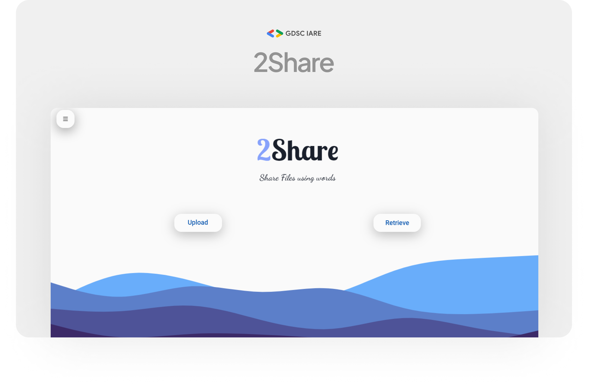
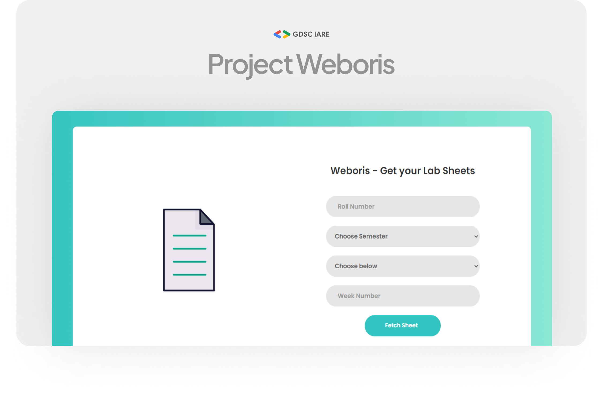

import { Callout } from 'nextra/components'

# Tech Projects

Here's our list of amazing projects by the GDSC Tech Team. We're keeping few internal projects private, to avoid any sort of data leaks from our servers.

{/* ## Birthday Reminder Bot

The Birthday Reminder Bot is a Telegram bot built using the Python Telegram Bot API and powered by Deta for data storage. This bot is designed to help you keep track of birthdays and never miss an important occasion. With its intuitive interface and convenient features, you can effortlessly manage your friends' and family members' birthdays, receive timely reminders, and even send personalized birthday greetings.

Key Features:

* Easily add and store contact birthdays with name, date, and additional notes.
* Get friendly reminders for upcoming birthdays.
* Send personalized birthday greetings directly from the bot.
* User-friendly commands for managing birthdays.
* Secure storage and retrieval of birthday data using Deta database.

Whether you're a forgetful friend or simply want to stay organized, the Birthday Reminder Bot is the perfect companion to ensure you never miss a birthday again. Install the bot on Telegram, manage your contacts' birthdays, and delight your loved ones with timely and heartfelt greetings.

**Developed By:** [Syed Ikram Uddin](https://www.linkedin.com/in/syed-ikram-uddin-b74916187/)

**Project Link:** [Birthday Buddy Bot](https://t.me/Birthday_Buddy_Bot) */}

## Blogs Hub

GDSC IARE Blogs Hub is a website built for sharing technical blogs written by GDSC IARE members. The website is built using Next.js and Sanity.io, and it features a clean and minimal design. GDSC IARE Blogs Hub is a great resource for students who are interested in learning more about technology. The website features a wide variety of topics, including web development, data science, and artificial intelligence. GDSC IARE Blogs Hub is also a great way to stay up-to-date on the latest trends in technology. The website is updated regularly with new articles and blog posts.

Here are some of the features of GDSC IARE Blogs Hub:

* Clean and minimal design
* Wide variety of topics
* Regularly updated with new articles and blog posts
* Easy to use
* Mobile-friendly

If you are a student who is interested in learning more about technology, then GDSC IARE Blogs Hub is a great resource for you. Do give it a look at [gdsciareblogs.vercel.app](https://gdsciareblogs.vercel.app). You can also follow us on [Instagram](https://instagram.com/gdsciare) for updates.

**Developed By:** [Ujjwal Shivacharya](https://ujjwalshiva.github.io)

**Project Link:** [gdsciareblogs.vercel.app](https://gdsciareblogs.vercel.app)

## Certification Client

The Certification Client is a user-friendly web application designed to simplify the process of generating certificates for various technical events organized by colleges. Built using Python, Streamlit, and PIL (Python Imaging Library) functions, this efficient tool streamlines the certificate generation process.

* Simplified certificate generation for technical events in college, saving time and effort.
* User-friendly web interface for easy navigation and operation.
* Efficiently eliminates manual certificate design and data entry.
* Supports bulk certificate generation for events with a large number of participants.
* Download certificates in printable format or share them electronically for quick distribution.

<Callout type="info" emoji="😮">
P.S. This web app was also used to generate hundreds of certificates for participants who participated at **Consortium 2022** - the biggest technical fest organized by IARE, Hyderabad in the year 2022. GDSC IARE was proudly the technical partner for the entire series of events.
</Callout>

**Developed By:** [Ujjwal Shivacharya](https://ujjwalshiva.github.io) and [Vishnu Sai Nadella](https://www.linkedin.com/in/vishnu-nadella-007/)

**Project Link:** [consortium-2022.streamlit.app](https://consortium-2022.streamlit.app)

## Check Fast App

This is an Android App submission made to Google Developers Student Clubs - India Regional Team as a part of Kotlin and Compose Camp, organized in the month of September 2022.

Problem Statement: Provide a useful app for students to quickly check out things that matter to them the most.

Proposed Solution: We've built an app that supports the following features -

* Check college attendance and know how many classes to attend to stay over 75%
* Plan your next CGPA by getting to know how much you will have to score this semester
* Split food bills easily with your friends using our fast and simple tool

**Developed By:** [Praneetha Peniji](#) and [Core Team - GDSC IARE](/about#core-team-2022-23)

**Application Link:** [APK Link](https://drive.google.com/file/d/1GiFSWto0iwAcgIrdWPMtVvuNZTksVnv1/view?usp=sharing)   |    [Github Link](https://github.com/praneetha28-ai/checkFast)

## CodeLink Web App

Codelink is an online platform where developers can share code snippets easily with just a short link. It is a great way to collaborate with other developers, share your code with the world, and learn new coding techniques.

Here are some of the features of Codelink:

* Easy to use: Share code snippets with just a short link.
* Secure: Your code snippets are stored in a secure environment using Firebase.
* Collaborative: Collaborate with other developers and get feedback.
* Learning: Learn new coding techniques by browsing through code snippets.

If you are a developer, then Codelink is a great platform for you. Codelink makes it easy to share your code, collaborate with other developers, and learn new coding techniques.

**Developed By:** [Ujjwal Shivacharya](https://ujjwalshiva.github.io)

**Project Link:** [Project Codelink](https://gdsciare.club/codelink)

## DigiAuth App

<Callout type="info" emoji="😯">
Now rebranded as **AuthIn**, this system has been used in mega events like PROST 2023, Social Media Summit 2023, and many more, to authorize over **15000+** attendees in a seamless and secure manner.
</Callout>

DigiAuth is an online app that allows event organizers to authenticate attendees with QR codes. DigiAuth is a convenient and secure way to check in attendees at events.

Here are some of the features of DigiAuth:

* Quick: DigiAuth uses QR codes to check in attendees quickly.
* Secure: DigiAuth uses a secure authentication process to ensure that only authorized attendees can enter the event.
* Reliable: DigiAuth provides real-time data on attendance, which can be used to track attendance and identify any potential problems.

If you are an event organizer, then DigiAuth is a great tool for you. DigiAuth can help you save time, improve security, and collect valuable data.

**Developed By:** [Vishnu Sai Nadella](https://www.linkedin.com/in/vishnu-nadella-007/)

**Project Link:** Contact [Vishnu](https://t.me/JorjHudson)

## NBA Tracker Bot

NBA Tracker bot is a Telegram bot that instantly sends updates after an NBA match has finished. The bot uses Deta and NBA API to fetch live results from the internet as the match progresses.

Here are some of the features of the NBA Tracker bot:

* Instant updates: NBA Tracker bot sends updates instantly after an NBA match has finished.
* Live results: NBA Tracker bot fetches live results from the internet as the match progresses.
* Easy to use: NBA Tracker bot is easy to use. Simply add the bot to your Telegram account and start tracking your favorite NBA teams.

If you are looking for a way to stay up-to-date on the latest NBA news and scores, never miss a game, and get more involved in the NBA, then NBA Tracker bot is a great option for you.

**Developed By:** [Sri Vishal Lanka](https://www.linkedin.com/in/sri-vishal-lanka-73a7b420a/)

**Project Link:** [NBA Tracker Bot](https://t.me/nbaupdates_bot)

## Open Source Platform

Well, this is what you're looking at! GDSC IARE Open Source Platform is a mega website that stores all information regarding GDSC IARE. It was built by GDSC Lead Ujjwal Shivacharya, to promote transparency and open-source contributions amongst the community members. The platform includes:

* Events: A synopsis of GDSC IARE events, including speaker sessions, workshops, and hackathons.
* Projects: A showcase of projects that have been developed by the community.
* Resources: A library of resources, such as tutorials, articles, and documentation.
* Community: A forum where members can connect with each other and discuss topics related to software development.

**Developed By:** [Ujjwal Shivacharya](https://ujjwalshiva.github.io)

**Project Link:** [GDSC Open Source Platform](https://docs.gdsciare.club)

## QBS Archive

<Callout emoji="🔥">
QBS Archive Web App has served more than **5500+** requests since its launch 
</Callout>

QBS Archive is a website where students of IARE can obtain solutions to question banks semester-wise. The solutions are contributed by students of the batch of 2024 (mostly by CSE and IT). This web app uses Tailwind UI and jsPDF to generate a beautiful-looking pdf that contains links to all the required subjects

Here are some of the features of QBS Archive:

* Solutions: provides solutions to question bank semester-wise.
* Contributions: encourages students to contribute solutions to the question bank.
* Search: allows students to search for solutions by semester and subject name.
* Easy to use: It is easy to use. Simply navigate to the desired semester, subject to generate a unique pdf with links just for you

**Developed By:** [Ujjwal Shivacharya](https://ujjwalshiva.github.io)

**Project Link:** [QBS Archives](https://qbsolutions.gdsciare.club/)

## ToShare - Share Files using words

ToShare is a cool web app that allows you to share files with others using IPFS, React, and Firebase. It is secure, private, and easy to use. Here are some notable features of ToShare:

* Decentralized: Your files are not stored on any central server, which makes them more secure and private.
* Easy to use: Simply upload your file to the app, and then share the word with the people you want to share it with.
* Secure: Your files are encrypted while they are in transit and at rest.
* Private: Only you and the people you share your files with can access them, or you can keep it public.

**Developed By:** [Rishi Raj](https://www.linkedin.com/in/rishi-raj-a36930206/)

**Project Link:** [ToShare - Web App](https://toshare.vercel.app/)

## IARE The Events App

<Callout type="warning" emoji="⚒">
This is a work in progress. Stay Tuned to be blown away :)
</Callout>

**Developed By:** [Vishnu Sai Nadella](https://www.linkedin.com/in/vishnu-nadella-007/) and [Ujjwal Shivacharya](https://ujjwalshiva.github.io)

**Project Link:** [Coming Soon](#)

## Weboris Web App

<Callout emoji="🔥">
Weboris has served more than **4500+** requests since it's launch 
</Callout>

Weboris is a web app that helps students of IARE download lab sheets directly from the server. The app uses a responsive design to check lab sheets based on roll number and fetches the required lab sheets conveniently.

Here are some of the features of Weboris:

* Weboris allows students to download lab sheets directly from the server.
* Weboris uses responsive design, which means that it can be used on any device, including smartphones, tablets, and laptops.
* Weboris allows students to check lab sheets based on their roll number.
* Weboris fetches the required lab sheets conveniently, so students do not have to search for them.

**Developed By:** [Sri Vishal Lanka](https://www.linkedin.com/in/sri-vishal-lanka-73a7b420a/) and [Syed Ikram Uddin](https://www.linkedin.com/in/syed-ikram-uddin-b74916187/)

**Project Link:** [Weboris Web App](https://gdsciare.club/weboris)
