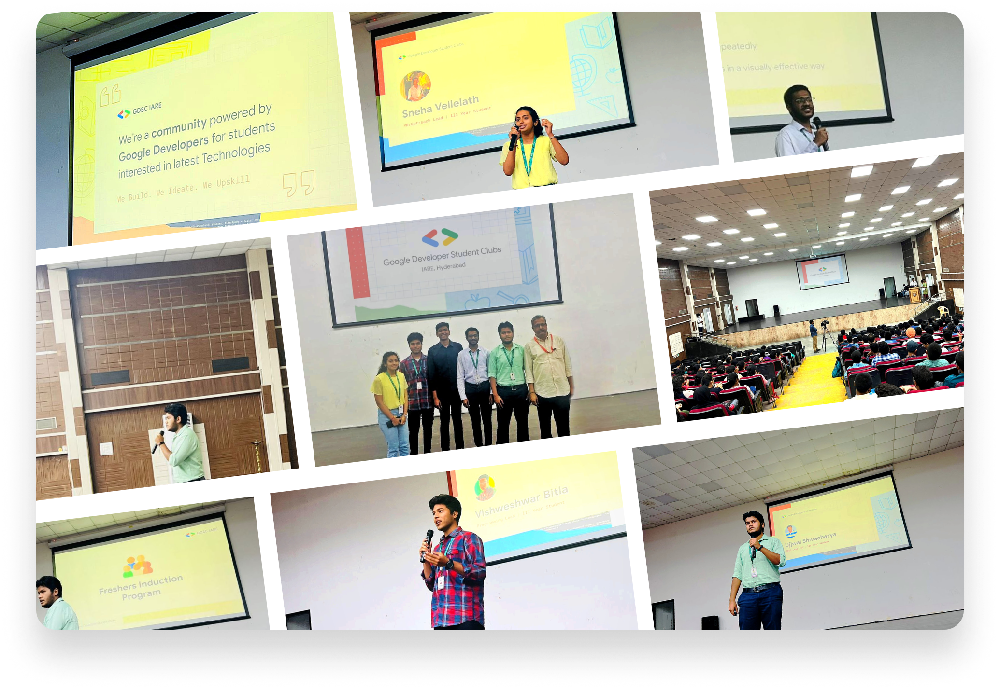
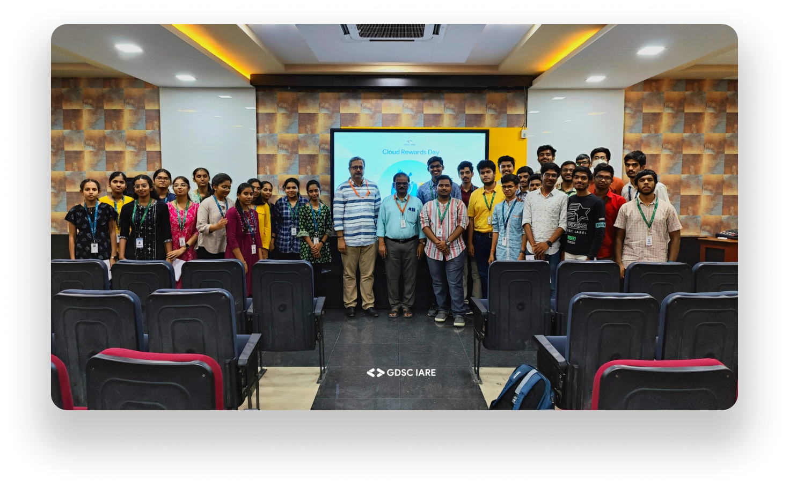

import Image from 'next/image'
 
# What We Do

We are a group of students passionate about Technology. Our objective is to bring together students from various fields of interest who love learning and applying their skills to solve real-world problems.

Have a look at the various events and activities we organize to help our student members learn about and grow their skills in software development.

* **Workshops**: We organize workshops on a variety of topics related to software development, such as web development, mobile development, and data science.
* **Meetups**: We also come up with meetups where students can meet and network with other developers.
* **Hackathons**: We also organize hackathons where students can work together to build innovative software projects.
* **Coding competitions**: We conduct several coding competitions where students can compete against each other to solve coding challenges.

